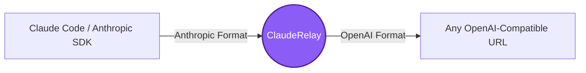

<div align="center">
  
  # 🚀 ClaudeRelay
  
  **The Ultimate Anthropic → OpenAI Proxy Wrapper**
  
  [](https://nodejs.org/)
  [](#)
  [](#)
  [](#)

  <p align="center">
    Use <b>Claude Code</b> or any Anthropic SDK with <b>ANY OpenAI-compatible URL</b>.<br>
    NVIDIA NIM, Groq, OpenRouter, Together AI, Ollama, LM Studio — they all work seamlessly.
  </p>
</div>

---

## 📋 Table of Contents

- [Why ClaudeRelay?](#-why-clauderelay)
- [Quick Start](#-quick-start)
  - [1. Configuration](#1-configuration)
  - [2. Start the Relay](#2-start-the-relay-)
  - [3. Point Claude Code at the Relay](#3-point-claude-code-at-the-relay-)
- [Configuration (.env)](#️-configuration-env)
- [Supported Providers](#-supported-providers)
- [Testing](#-testing)
- [How It Works (Deep Dive)](#-how-it-works-deep-dive)
- [File Reference](#-file-reference)

---

## ✨ Why ClaudeRelay?

Claude Code and the Anthropic SDK natively only talk to Anthropic's servers. **ClaudeRelay** acts as an invisible middleman that translates Anthropic's API format into the standard OpenAI format on the fly — and translates the response back. No code changes. No hacks. Just works.



### 🌟 Key Features
- ⚡ **Zero Dependencies** — Pure Node.js built-ins. Just download and run!
- 🔄 **Universal Wrapper** — Point it to **any** OpenAI-compatible URL and it just works.
- 📡 **Full Streaming (SSE) Support** — Watch responses stream in real-time.
- 🛠️ **Tool / Function Calling** — Fully supports Claude's tool use mapped to OpenAI tools.
- 🛡️ **Auto Rate-Limit Queue** — Built-in protection against `429 Too Many Requests`.
- 🔌 **Graceful Disconnects** — Never crashes when the client disconnects mid-stream.
- 💻 **Cross-Platform** — Native runner scripts for Windows, macOS, and Linux.

---

## 🚀 Quick Start

### 1. Configuration
Copy the `.env.example` to `.env` and enter your OpenAI-compatible URL and API key.

```bash
# Linux / macOS
cp .env.example .env
# then open .env in any editor and fill in your API key

# Windows
copy .env.example .env
```

> ⚠️ **Mac / Linux:** `.env` files start with `.` and are hidden by default in Finder. In terminal, run `ls -la` to see them. Press `Cmd + Shift + .` in Finder to toggle visibility.

### 2. Start the Relay 🏃‍♂️

| OS / Method | Command / Action |
|-------------|------------------|
| **macOS / Linux** | `./linux-mac/start-proxy.sh` |
| **Windows** | Double-click `windows\start-proxy.bat` or run `.\windows\start-proxy.bat` |
| **Node Direct** | `node proxy.js` |

### 3. Point Claude Code at the Relay 🎯

Tell Claude Code to talk to ClaudeRelay instead of Anthropic's servers.

**Linux / macOS:**
```bash
export ANTHROPIC_BASE_URL="http://localhost:20128"
export ANTHROPIC_API_KEY="proxy"
claude
```

> 💡 **Make it permanent (Mac/Linux):** The `export` above only lasts for the current terminal session. To make it stick across all terminals:
> ```bash
> # macOS (zsh)
> echo 'export ANTHROPIC_BASE_URL="http://localhost:20128"' >> ~/.zshrc
> echo 'export ANTHROPIC_API_KEY="proxy"' >> ~/.zshrc
> source ~/.zshrc
>
> # Linux (bash)
> echo 'export ANTHROPIC_BASE_URL="http://localhost:20128"' >> ~/.bashrc
> echo 'export ANTHROPIC_API_KEY="proxy"' >> ~/.bashrc
> source ~/.bashrc
> ```
> After this, every new terminal auto-points at ClaudeRelay. Just start the proxy first.

**Windows (PowerShell — current session only):**
```powershell
$env:ANTHROPIC_BASE_URL = "http://localhost:20128"
$env:ANTHROPIC_API_KEY  = "proxy"
claude
```

> 💡 **Make it permanent (Windows):** Create `C:\Users\<YourUsername>\.claude\settings.json` with:
> ```json
> {
>   "env": {
>     "ANTHROPIC_BASE_URL": "http://localhost:20128",
>     "ANTHROPIC_API_KEY": "proxy"
>   }
> }
> ```
> Claude Code reads this on startup automatically — no env commands needed each session.

---

## ⚙️ Configuration (`.env`)

You can easily switch providers just by editing `.env`. No code changes required!

| Variable | Default | Description |
|----------|---------|-------------|
| `LLM_BASE_URL` | `https://integrate.api.nvidia.com/v1` | **Any OpenAI-compatible URL** |
| `LLM_API_KEY` | *(required)* | Your provider's API key |
| `MODEL` | `nvidia/nemotron-...` | The specific model name to send to the upstream API |
| `ANTHROPIC_BASE_URL` | `http://localhost:20128` | Where Anthropic clients should connect |
| `ANTHROPIC_API_KEY` | `proxy` | Fake key for the proxy (any string works) |
| `PROXY_PORT` | `20128` | Local port for ClaudeRelay |
| `PROXY_RATE_LIMIT_RPM` | `38` | Max upstream requests per minute |
| `PROXY_TIMEOUT_SECONDS` | `300` | Upstream request timeout |

---

## 🌍 Supported Providers

Change `LLM_BASE_URL`, `LLM_API_KEY`, and `MODEL` in `.env`, then restart the proxy.

| Provider | `LLM_BASE_URL` | Example `MODEL` |
|----------|---------------|-----------------|
| **NVIDIA NIM** (default) | `https://integrate.api.nvidia.com/v1` | `nvidia/nemotron-3-super-120b-a12b` |
| **Groq** | `https://api.groq.com/openai/v1` | `llama-3.3-70b-versatile` |
| **OpenRouter** | `https://openrouter.ai/api/v1` | `google/gemini-flash-1.5` |
| **Together AI** | `https://api.together.xyz/v1` | `meta-llama/Llama-3-70b-chat-hf` |
| **Ollama** (Local) | `http://localhost:11434/v1` | `llama3` |
| **LM Studio** | `http://localhost:1234/v1` | `llama3` |

> 💡 **Tip:** For local providers like Ollama or LM Studio, set `LLM_API_KEY=local` — any non-empty string works.

---

## 🧪 Testing

ClaudeRelay comes with a built-in diagnostic test suite (71 tests across 2 suites) to ensure everything works flawlessly with your chosen provider.

**macOS / Linux:**
```bash
./tests/run-tests.sh
```

**Windows:**
```bat
tests\run-tests.bat
```

> **Note:** The test scripts automatically start and stop the proxy for you!

The suite covers: health check, non-streaming, streaming SSE, tool calling, rate-limit queuing, malformed inputs, client disconnects, concurrency, and full Anthropic response shape compliance.

---

## 🔬 How It Works (Deep Dive)

### The Request Journey

```
1. Claude Code sends POST /v1/messages  (Anthropic JSON format)
2. ClaudeRelay intercepts and converts:
   - Moves "system" field → injects as {"role":"system"} message
   - Unpacks content blocks → plain strings
   - Converts Anthropic tool schema → OpenAI function schema
3. Forwards to your upstream LLM (LLM_BASE_URL)
4. Response (streaming or not) is converted back to Anthropic format:
   - Wraps strings → content block arrays
   - Renames finish_reason:"stop" → stop_reason:"end_turn"
   - Synthesizes Anthropic SSE events (message_start, content_block_start, etc.)
5. Claude Code receives it as if it came from Anthropic's servers
```

### Streaming Translation

Streaming is the trickiest part. OpenAI's stream is "dumb" — it fires raw text chunks as fast as possible. But Anthropic's stream expects a highly choreographed sequence of events.

ClaudeRelay acts as a **state machine** to solve this:
1. Before forwarding the first word, it **manually fires** a `message_start` and `content_block_start` event.
2. As OpenAI streams words, it wraps each word in a `content_block_delta` event.
3. When OpenAI closes the connection, the proxy fires `content_block_stop` and `message_stop` so Claude Code gracefully finishes instead of crashing.

Both sides are completely fooled into thinking they are talking to their native ecosystem.

### Feature Checklist
- ✅ Streaming (SSE) and non-streaming responses
- ✅ Tool / function calling
- ✅ System prompts, multi-turn conversations
- ✅ Per-minute rate limiting with automatic queue (no 429 crashes)
- ✅ Request timeout with graceful 529 response (Claude Code retries automatically)
- ✅ Client disconnect handled — no server crash, no restart needed
- ✅ HTTP and HTTPS upstream (auto-detected from `LLM_BASE_URL`)
- ✅ Zero npm dependencies — pure Node.js built-ins only
- ✅ Works on Windows, Linux, and macOS

---

## 🔍 Adding Web Search (Recommended)

When using ClaudeRelay, Anthropic's built-in web search is **not available** because it runs on Anthropic's own servers. To give Claude Code web search capability, we highly recommend adding the DuckDuckGo MCP server (`duckduckgo-mcp-server`) or a similar search MCP to your Claude Code configuration. This allows searches to run locally and seamlessly through the proxy without needing API keys.

---

## 📁 File Reference

```
ClaudeRelay/
├── proxy.js              Main proxy server (cross-platform)
├── .env                  Your config (API key, model, URLs) — don't commit!
├── .env.example          Config template with docs and provider examples
├── package.json          npm start / npm test scripts
├── requirements.txt      System requirements (Node >= 18)
│
├── linux-mac/
│   └── start-proxy.sh    Linux/macOS: run the proxy
│
├── windows/
│   └── start-proxy.bat   Windows: double-click to start
│
└── tests/
    ├── run-tests.sh      Linux/macOS: start proxy + run all tests + stop proxy
    ├── run-tests.bat     Windows: start proxy + run all tests + stop proxy
    ├── test-proxy.js     Core suite   (31 assertions)
    └── limits-test.js    Boundary suite (40 assertions)
```

---
<p align="center">
  <i>Built with ❤️ to bridge Anthropic and OpenAI ecosystems.</i>
</p>
