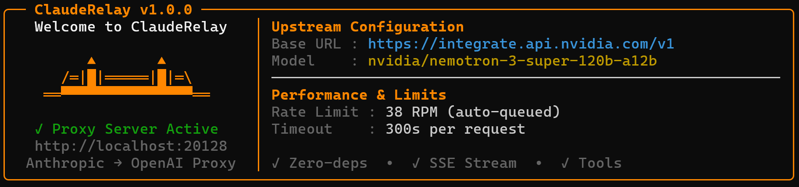
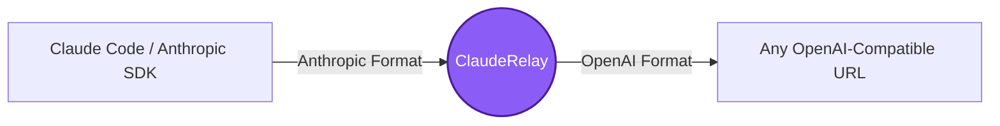

<div align="center">
  
  # ❋ Claude-Relay
  
  
  
  **The Ultimate Anthropic → OpenAI Proxy Wrapper**
  
  [](https://nodejs.org/)
  [](#)
  [](#)
  [](#)

  <p align="center">
    Use <b>Claude Code</b> or any Anthropic SDK with <b>ANY OpenAI-compatible URL</b>.<br>
    NVIDIA NIM, Groq, OpenRouter, Together AI, Ollama, LM Studio - they all work seamlessly.
  </p>
</div>

---

## 📋 Table of Contents

- [Why ClaudeRelay?](#-why-clauderelay)
- [Quick Start](#-quick-start)
  - [1. Configuration](#1-configuration)
  - [2. Start the Relay](#2-start-the-relay-)
  - [3. Point Claude Code at the Relay](#3-point-claude-code-at-the-relay-)
- [Configuration (.env)](#️-configuration-env)
- [How It Works (Deep Dive)](#-how-it-works-deep-dive)
- [File Reference](#-file-reference)

---

## ✨ Why ClaudeRelay?

Claude Code and the Anthropic SDK natively only talk to Anthropic's servers. **ClaudeRelay** acts as an invisible middleman that translates Anthropic's API format into the standard OpenAI format on the fly and translates the response back. No code changes. No hacks. Just works.



### 🌟 Key Features
- ⚡ **Zero Dependencies** : Pure Node.js built-ins. Just download and run!
- 🔄 **Universal Wrapper** : Point it to **any** OpenAI-compatible URL and it just works.
- 📡 **Full Streaming (SSE) Support** : Watch responses stream in real-time.
- 🛠️ **Tool / Function Calling** : Fully supports Claude's tool use mapped to OpenAI tools.
- 🔌 **Graceful Disconnects** : Never crashes when the client disconnects mid-stream.
- 💻 **Cross-Platform** : Native runner scripts for Windows, macOS, and Linux.

---

## 🚀 Quick Start

### 1. Configuration
Copy the `.env.example` to `.env` and enter your OpenAI-compatible URL and API key.

```bash
# Linux / macOS
cp .env.example .env
# then open .env in any editor and fill in your API key

# Windows
copy .env.example .env
```

> ⚠️ **Mac / Linux:** `.env` files start with `.` and are hidden by default in Finder. In terminal, run `ls -la` to see them. Press `Cmd + Shift + .` in Finder to toggle visibility.

### 2. Start the Relay 🏃‍♂️

| OS / Method | Command / Action |
|-------------|------------------|
| **macOS / Linux** | `./linux-mac/start-proxy.sh` |
| **Windows** | Double-click `windows\start-proxy.bat` or run `.\windows\start-proxy.bat` |
| **Node Direct** | `node proxy.js` |

### 3. Point Claude Code at the Relay 🎯

Tell Claude Code to talk to ClaudeRelay instead of Anthropic's servers.

**Linux / macOS:**
```bash
export ANTHROPIC_BASE_URL="http://localhost:20128"
export ANTHROPIC_API_KEY="proxy"
claude
```

> 💡 **Make it permanent (Mac/Linux):** The `export` above only lasts for the current terminal session. To make it stick across all terminals:
> ```bash
> # macOS (zsh)
> echo 'export ANTHROPIC_BASE_URL="http://localhost:20128"' >> ~/.zshrc
> echo 'export ANTHROPIC_API_KEY="proxy"' >> ~/.zshrc
> source ~/.zshrc
>
> # Linux (bash)
> echo 'export ANTHROPIC_BASE_URL="http://localhost:20128"' >> ~/.bashrc
> echo 'export ANTHROPIC_API_KEY="proxy"' >> ~/.bashrc
> source ~/.bashrc
> ```
> After this, every new terminal auto-points at ClaudeRelay. Just start the proxy first.

**Windows (PowerShell — current session only):**
```powershell
$env:ANTHROPIC_BASE_URL = "http://localhost:20128"
$env:ANTHROPIC_API_KEY  = "proxy"
claude
```

> 💡 **Make it permanent (Windows):** Create `C:\Users\<YourUsername>\.claude\settings.json` with:
> ```json
> {
>   "env": {
>     "ANTHROPIC_BASE_URL": "http://localhost:20128",
>     "ANTHROPIC_API_KEY": "proxy"
>   }
> }
> ```
> Claude Code reads this on startup automatically — no env commands needed each session.

---

## ⚙️ Configuration (`.env`)

You can easily switch providers just by editing `.env`. No code changes required!

| Variable | Default | Description |
|----------|---------|-------------|
| `LLM_BASE_URL` | `https://integrate.api.nvidia.com/v1` | **Any OpenAI-compatible URL** |
| `LLM_API_KEY` | *(required)* | Your provider's API key |
| `MODEL` | `nvidia/nemotron-...` | The specific model name to send to the upstream API |
| `VISION_BASE_URL` | *(optional)* | Fallback API URL for image requests |
| `VISION_API_KEY` | *(optional)* | Fallback API key for image requests |
| `VISION_MODEL` | *(optional)* | Fallback model name for image requests |
| `VISION_CHAINING` | `true` | If true, uses the Vision Model purely to describe the image, and sends the description to the Base Model |
| `ANTHROPIC_BASE_URL` | `http://localhost:20128` | Where Anthropic clients should connect |
| `ANTHROPIC_API_KEY` | `proxy` | Fake key for the proxy (any string works) |
| `PROXY_PORT` | `20128` | Local port for ClaudeRelay |
| `PROXY_TIMEOUT_SECONDS` | `300` | Upstream request timeout |

> 💡 **Tip:** For local providers like Ollama or LM Studio, set `LLM_API_KEY=local` — any non-empty string works.

---

## 🔬 How It Works (Deep Dive)

### The Request Journey

```
1. Claude Code sends POST /v1/messages  (Anthropic JSON format)
2. ClaudeRelay intercepts and converts:
   - Moves "system" field → injects as {"role":"system"} message
   - Unpacks content blocks → plain strings
   - Converts Anthropic tool schema → OpenAI function schema
3. Forwards to your upstream LLM (LLM_BASE_URL)
4. Response (streaming or not) is converted back to Anthropic format:
   - Wraps strings → content block arrays
   - Renames finish_reason:"stop" → stop_reason:"end_turn"
   - Synthesizes Anthropic SSE events (message_start, content_block_start, etc.)
5. Claude Code receives it as if it came from Anthropic's servers
```

### Feature Checklist
- ✅ Streaming (SSE) and non-streaming responses
- ✅ Tool / function calling
- ✅ System prompts, multi-turn conversations
- ✅ Request timeout with graceful 529 response (Claude Code retries automatically)
- ✅ Client disconnect handled — no server crash, no restart needed
- ✅ HTTP and HTTPS upstream (auto-detected from `LLM_BASE_URL`)
- ✅ Zero npm dependencies — pure Node.js built-ins only
- ✅ Works on Windows, Linux, and macOS

---

## 🔍 Enabling Web Search

When using ClaudeRelay, Anthropic's built-in web search is **not available** because it relies on their internal servers. To give Claude Code robust web search capability (without getting blocked by Google/bot protections), we highly recommend setting up the **Google Search MCP**:

1. **Install the MCP**
   **Mac / Linux:**
   ```bash
   claude mcp add google-search npx -y @fdcicyber/google-search-mcp
   ```
   **Windows:**
   ```bash
   claude mcp add google-search npx.cmd -y @fdcicyber/google-search-mcp
   ```

2. **Install the required Chromium version** (prevents stealth browser crashes)
   ```bash
   npx puppeteer browsers install chrome@151.0.7922.71
   ```

3. **Disable the broken native search tools**
   Always start Claude Code with this flag to force it to use the new MCP:
   ```bash
   claude --disallowed-tools WebSearch,WebFetch
   ```

This allows searches to run locally and seamlessly through a stealth browser without needing any API keys.

---

## 🖼️ Vision Chaining Support

ClaudeRelay automatically detects if an incoming request contains images (e.g., dragging a UI screenshot into Claude Code). By default, it uses a powerful feature called **Vision Chaining**:

1. The relay intercepts the image and sends it to your **Vision Model** (`VISION_MODEL`) to generate a detailed text description.
2. It replaces the image payload in your request with the generated text description.
3. The modified request is sent to your **Base Model** (`MODEL`).

This allows your Base Model (which might lack native vision capabilities but excels at reasoning and tool-calling, like Nemotron 120B) to "see" the image through the Vision Model's description!

If you want to disable chaining and send the image directly to your model (if it natively supports vision), set `VISION_MODEL` to exactly the same value as `MODEL` in your `.env`, or set `VISION_CHAINING=false`.

If you don't define `VISION_BASE_URL`, `VISION_API_KEY`, or `VISION_MODEL` in your `.env`, it will safely fall back to using your standard `LLM_BASE_URL` config.

---


## 📁 File Reference

```
ClaudeRelay/
├── proxy.js              Main proxy server (cross-platform)
├── .env                  Your config (API key, model, URLs) — don't commit!
├── .env.example          Config template with docs and provider examples
├── package.json          npm start / npm test scripts
├── requirements.txt      System requirements (Node >= 18)
│
├── linux-mac/
│   └── start-proxy.sh    Linux/macOS: run the proxy
│
├── windows/
│   └── start-proxy.bat   Windows: double-click to start
│
└── tests/
    ├── run-tests.sh      Linux/macOS: start proxy + run all tests + stop proxy
    ├── run-tests.bat     Windows: start proxy + run all tests + stop proxy
    ├── test-proxy.js     Core suite   (31 assertions)
    └── limits-test.js    Boundary suite (40 assertions)
```

---
<p align="center">
  <i>Built with ❤️ to bridge Anthropic and OpenAI ecosystems.</i> <br>
  <i>                                           -Husain Ghulam</i>
</p>
